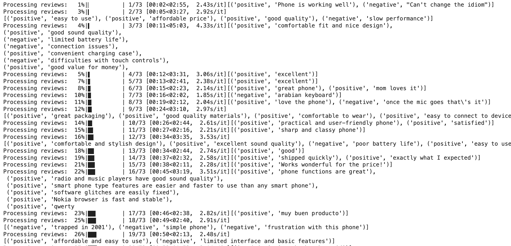
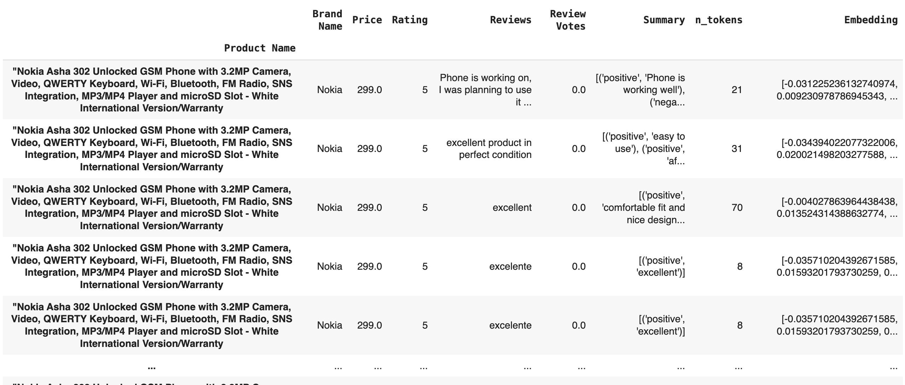
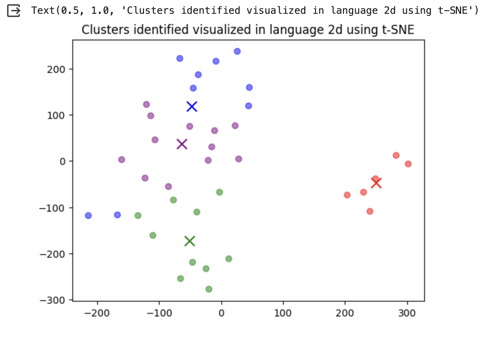
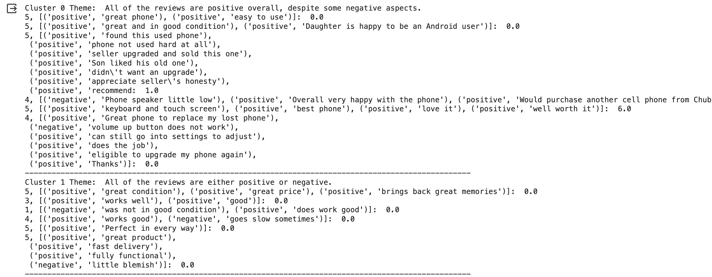
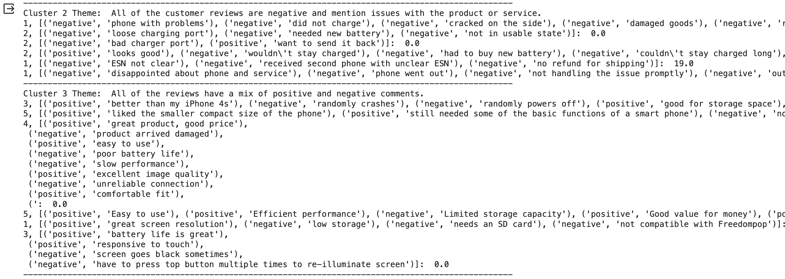
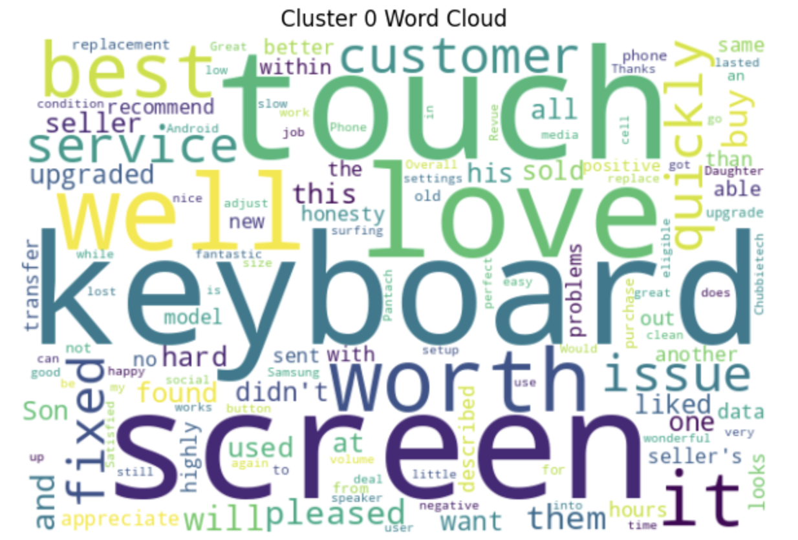
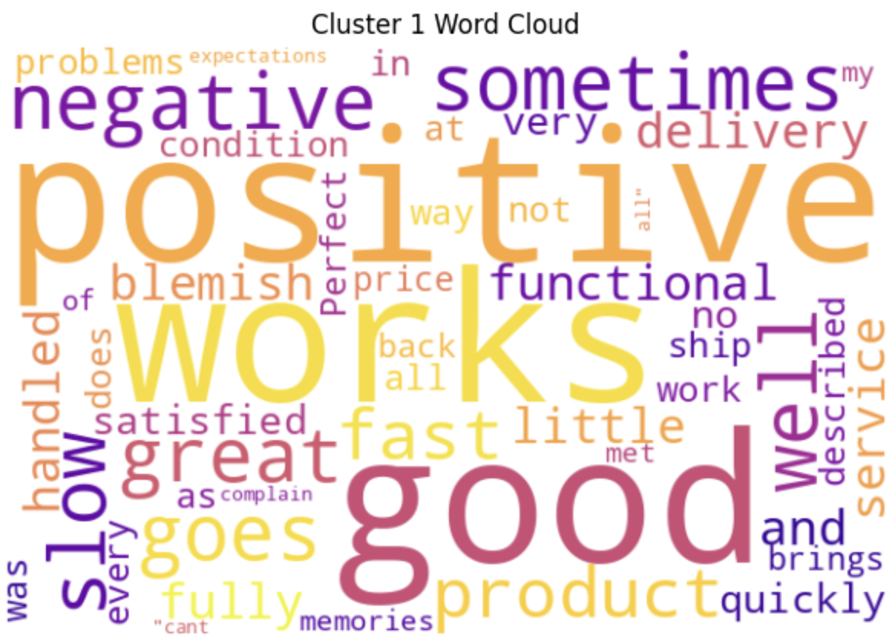
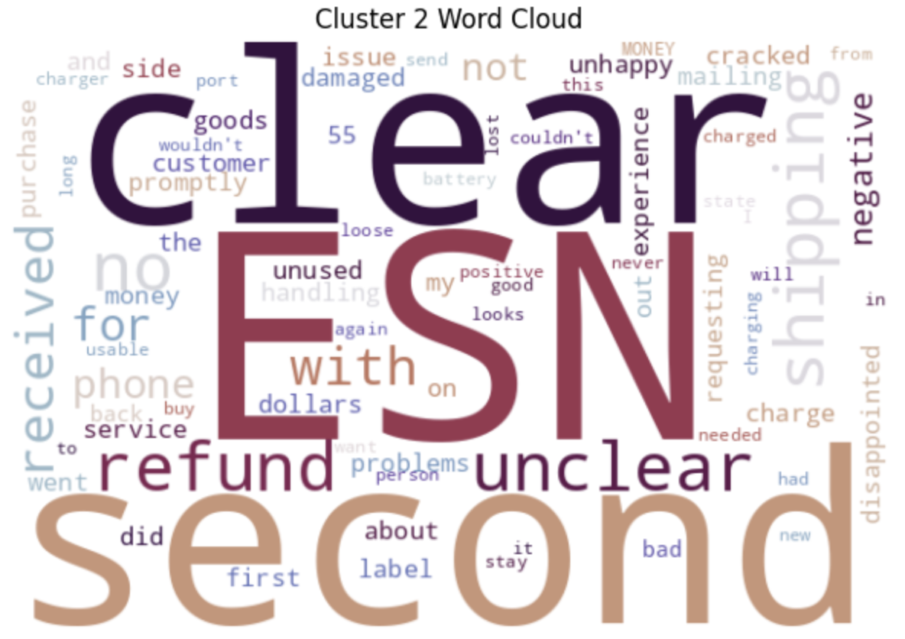
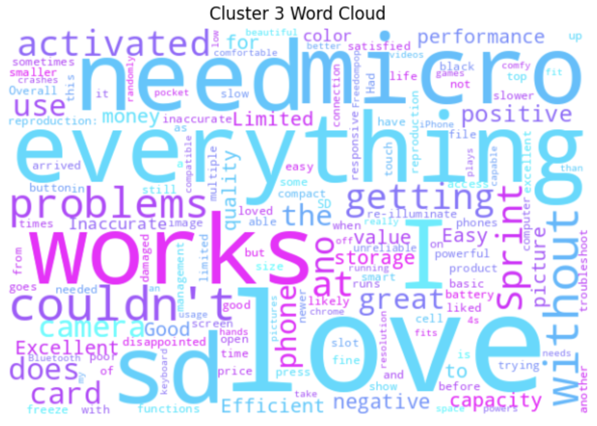

# DistilLM: The Sales Support Employee You Wish You Had

## 2023 LauzHack AWS & AXA Challenge

---

### Team

- Gabriel Agerholm
- Ihchae Ryu
- Keita Hidaka

### Goal of Challenge

1. Extract general problems from customer reviews dataset and present useful feedback
2. Useful application of LLMs

### Process and Results

1. Text distilled via LLM

2. Embedding text via OpenAI
   

3. Clustering via K-Means

4. Analyzing and extracting cluster themes

5. Reliable issues in wordclouds

